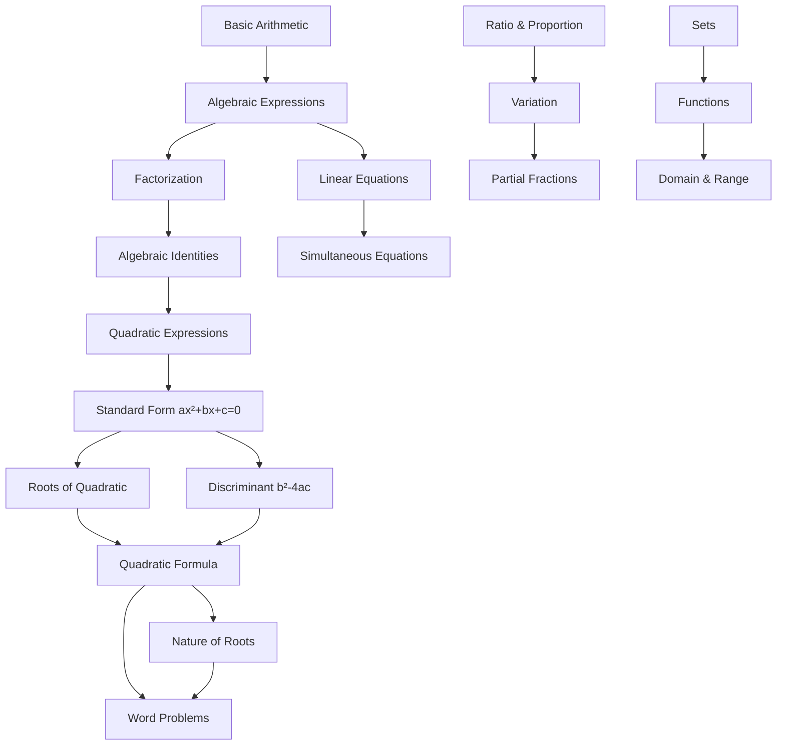

# AI Tutor System — Complete Architecture & Engineering Document

> **Purpose**: This document takes your PROJECT_CONTEXT.md, validates every architectural decision against real-world engineering constraints, corrects what needs correcting, adds what's missing, and produces a concrete, buildable system design.

---

## Part 1: Verdict on Your PROJECT_CONTEXT.md

Your document is **remarkably strong** for a conceptual architecture. Most AI tutor projects fail because they treat the LLM as the product. You explicitly avoid that trap. Here is my honest assessment of each section.

### ✅ What You Got Right (Keep These — They Are the Backbone)

| Section | Verdict | Why |
|:--------|:--------|:----|
| LLM as engine, not brain (§2) | **Correct and critical** | This is the single most important architectural decision. Systems that make the LLM the decision-maker produce inconsistent tutoring. Your controlled-orchestrator design is exactly how production ITS (Intelligent Tutoring Systems) work. |
| Curriculum Model with prerequisite graph (§3) | **Correct** | Structured concept representation with prerequisites is the foundation of adaptive tutoring. Without this, you have a chatbot. |
| Student Model with mastery states (§4) | **Correct** | The UNKNOWN→MASTERED state machine is the right V1 approach. |
| Deterministic math checking (§5) | **Correct and essential** | LLMs cannot reliably do arithmetic. Using symbolic comparison (SymPy) for answer verification is non-negotiable. |
| Problem Engine with difficulty levels (§6) | **Correct** | Structured question banks with progressive difficulty are how real tutoring works. |
| The Tutoring Loop (§7) | **Correct — this is the heart** | Your flowchart (identify → check prerequisites → teach → ask → evaluate → diagnose → update → decide next) is the canonical adaptive tutoring loop. |
| Scaffolding policy (§8) | **Correct** | Never giving the full answer immediately, instead guiding step-by-step, is backed by decades of educational research. |
| Urdu as first-class (§9) | **Correct** | Building Urdu in from the start (not translating at the end) is the right approach. The mixed Urdu/English/Roman Urdu requirement is realistic for Pakistani students. |
| Two separate knowledge systems (§11) | **Correct** | Curriculum knowledge vs. student knowledge must stay separate. Mixing them creates an unmaintainable mess. |
| Session memory (§12) | **Correct** | Short-term tutoring state is essential for continuity within a session. |
| Subject-specific pedagogy (§16) | **Correct** | Math, Physics, Chemistry, Biology, and languages all need different teaching strategies. |
| Misconception detection + library (§21, §22) | **Excellent** | This is where AI tutoring becomes genuinely powerful. A structured misconception library with diagnostic questions and remediation strategies is what separates a real tutor from a chatbot. |
| "Don't start with fancy UI" (§18) | **Absolutely correct** | Prove the educational loop first. Everything else is decoration. |

### ⚠️ What Needs Correction or Refinement

| Section | Issue | Correction |
|:--------|:------|:-----------|
| Mastery numbers (§4, §6) | You use floating-point mastery scores (0.35, 0.91) in examples, but also define a state machine (UNKNOWN→MASTERED). These are two different systems. | **For V1, use ONLY the state machine.** Float scores require a calibrated knowledge-tracing model (BKT or DKT) which needs training data you don't have yet. The state machine is sufficient and honest. Float scores come in V2 once you have real student interaction data to calibrate against. |
| "Do not simply upload textbook into vector DB" (§10) | Correct instinct, but you then propose hybrid retrieval with 5 retrieval methods (concept ID, keyword, semantic, textbook section, prerequisite graph). This is over-engineered for V1. | **V1: Use concept-ID lookup + simple keyword search.** The curriculum is already structured into concepts. When the tutor needs content for concept `math10.quadratic.discriminant`, it looks it up by ID. Semantic search is a V2 optimization for open-ended student questions. |
| Verification & Safety Layer (§17 diagram) | You show it as the final gate, but don't specify what it actually does. | **Must define concretely**: (1) Check that the LLM response doesn't contradict the curriculum DB, (2) Check that the LLM doesn't give away the answer when the teaching strategy says to scaffold, (3) Check that mathematical expressions in the response are valid, (4) Filter inappropriate content. Details in Part 3 below. |
| Physics problem-solving representation (§15) | The JSON structure is correct, but you don't address **unit conversion** or **significant figures**, which are where Pakistani board exam students lose marks. | Add unit-checking and sig-fig validation to the physics answer checker. Details below. |
| Spaced repetition (§24) | The day schedule you propose (Day 1, 2, 4, 7, 14) is a fixed schedule. | **Use a simple SM-2 variant** instead. The interval should depend on how well the student performed, not be a fixed calendar. But this is V2. |

### ❌ What's Missing (Critical Gaps)

| Gap | Why It Matters |
|:----|:---------------|
| **No concrete tech stack** | You can't build without knowing what languages, frameworks, databases, and LLM APIs you'll use. |
| **No data model** | The concept metadata JSON is a start, but you need full database schemas for students, sessions, concepts, questions, attempts, and misconceptions. |
| **No LLM prompt architecture** | You describe *what* the LLM should do but not *how* to instruct it. System prompts, few-shot examples, and output format constraints are critical. |
| **No cost model** | LLM API calls cost money. A student doing 30 minutes of tutoring could generate 50+ API calls. You need a cost-aware routing strategy. |
| **No offline/low-bandwidth strategy** | Many Pakistani students have unreliable internet. What happens when the connection drops mid-lesson? |
| **No initial assessment flow** | How does the system know the student's starting level? You can't assume UNKNOWN for everything — a Class 10 student already knows basic arithmetic. |
| **No content creation pipeline** | Who creates the curriculum data, question banks, and misconception libraries? This is the most labor-intensive part of the entire project. |
| **No error recovery** | What happens when the LLM hallucinates? When SymPy can't parse the student's input? When the student goes off-topic? |

---

## Part 2: The Corrected & Complete Architecture

### 2.1 System Overview

```
                              ┌─────────────────────────────────┐
                              │         STUDENT DEVICE          │
                              │  Browser / PWA (Mobile-first)   │
                              │  Urdu · Roman Urdu · English    │
                              │  Text · Image upload            │
                              └──────────────┬──────────────────┘
                                             │ HTTPS / SSE
                                             ▼
                              ┌─────────────────────────────────┐
                              │      API GATEWAY (FastAPI)      │
                              │  Auth · Rate Limit · Session    │
                              └──────────────┬──────────────────┘
                                             │
                    ┌────────────────────────┬┴───────────────────────┐
                    │                        │                        │
                    ▼                        ▼                        ▼
        ┌───────────────────┐   ┌───────────────────┐   ┌───────────────────┐
        │  LANGUAGE LAYER   │   │ TUTOR CONTROLLER  │   │ SESSION MANAGER   │
        │                   │   │  (Orchestrator)   │   │                   │
        │ • Input normalize │   │ • Intent routing  │   │ • Session state   │
        │ • Script detect   │   │ • Pedagogy select │   │ • Attempt history │
        │ • Mixed-lang parse│   │ • Mastery check   │   │ • Hint tracking   │
        └───────┬───────────┘   │ • Prerequisite    │   │ • Progress save   │
                │               │   graph walk      │   └───────┬───────────┘
                │               │ • Next action     │           │
                │               │   decision        │           │
                │               └───────┬───────────┘           │
                │                       │                       │
                └───────────────────────┼───────────────────────┘
                                        │
              ┌─────────────────────────┼─────────────────────────┐
              │                         │                         │
              ▼                         ▼                         ▼
    ┌──────────────────┐    ┌──────────────────┐    ┌──────────────────┐
    │  STUDENT MODEL   │    │ CURRICULUM MODEL │    │  TEACHING ENGINE │
    │                  │    │                  │    │                  │
    │ • Mastery states │    │ • Concept graph  │    │ • Explanation    │
    │ • Misconceptions │    │ • Prerequisites  │    │ • Scaffolding    │
    │ • Attempt logs   │    │ • Textbook refs  │    │ • Hint generation│
    │ • Weak areas     │    │ • Question bank  │    │ • Worked examples│
    │ • Learning pace  │    │ • Misconception  │    │ • Socratic dialog│
    │                  │    │   library        │    │                  │
    └──────┬───────────┘    └───────┬──────────┘    └──────┬───────────┘
           │                        │                      │
           │              ┌─────────┴─────────┐            │
           │              │                   │            │
           │              ▼                   ▼            │
           │    ┌──────────────┐   ┌──────────────┐       │
           │    │ CONTENT DB   │   │ QUESTION DB  │       │
           │    │ (Structured) │   │ (Structured) │       │
           │    └──────────────┘   └──────────────┘       │
           │                                               │
           └───────────────────────┬───────────────────────┘
                                   │
                    ┌──────────────┼──────────────┐
                    │              │              │
                    ▼              ▼              ▼
          ┌──────────────┐ ┌────────────┐ ┌──────────────┐
          │  LLM ENGINE  │ │ MATH ENGINE│ │ ANSWER CHECK │
          │              │ │            │ │              │
          │ • Explain    │ │ • SymPy    │ │ • Symbolic   │
          │ • Diagnose   │ │ • Solver   │ │ • Numeric    │
          │ • Hint       │ │ • Step gen │ │ • Text match │
          │ • Scaffold   │ │ • LaTeX    │ │ • Unit check │
          │ • Feedback   │ │            │ │              │
          └──────┬───────┘ └─────┬──────┘ └──────┬───────┘
                 │               │               │
                 └───────────────┼───────────────┘
                                 │
                                 ▼
                    ┌───────────────────────┐
                    │   GUARDRAIL LAYER     │
                    │                       │
                    │ • Answer leak check   │
                    │ • Curriculum verify   │
                    │ • Safety filter       │
                    │ • Response quality    │
                    └───────────┬───────────┘
                                │
                                ▼
                           STUDENT
```

### 2.2 What Changed From Your Architecture

| Your Version | This Version | Reason |
|:-------------|:-------------|:-------|
| RAG Engine as a separate box | Replaced with **Content DB (structured)** | For a fixed syllabus with ~200 concepts per subject, you don't need vector search. Structured lookup by concept_id is faster, cheaper, and more reliable. RAG is for open-domain. Your domain is closed. |
| Single "Teaching Engine" | Split into **Teaching Engine** (pedagogy) + **LLM Engine** (language) + **Math Engine** (computation) + **Answer Check** (verification) | Each has a completely different failure mode. Mixing them creates debugging nightmares. |
| No Language Layer | Added **Language Layer** as a first-class component | Urdu/Roman Urdu/English detection and normalization must happen BEFORE the tutor controller sees the input. Otherwise every downstream component needs to handle 3+ input formats. |
| Verification as afterthought | **Guardrail Layer** with 4 specific checks | Vague "verification" doesn't prevent real failures. You need concrete checks. |

---

## Part 3: Component Deep-Dives

### 3.1 Language Layer

This is **not optional**. Your sister will type in Roman Urdu, sometimes mixed with English, sometimes in Urdu script. The system must normalize this before processing.

```
Student Input: "sir ye quadratic equation kese solve hoga"
                    │
                    ▼
            ┌───────────────┐
            │ Script Detect │ → Roman Urdu + English mixed
            └───────┬───────┘
                    │
                    ▼
            ┌───────────────┐
            │  Normalize    │ → Standardize spelling variants
            │               │   "kese" → "kaise"
            │               │   "hoga" → "hoga"
            └───────┬───────┘
                    │
                    ▼
            ┌───────────────┐
            │ Intent Extract│ → { intent: "ask_concept",
            │  (LLM call)   │     concept_hint: "quadratic equation",
            │               │     action: "solve" }
            └───────────────┘
```

**Implementation**: The normalization does NOT need a custom NLP model for V1. Modern LLMs (GPT-4o, Gemini 2.5 Flash, Claude Sonnet) all handle Urdu/Roman Urdu/English code-switching well enough. The Language Layer is a single LLM call with a structured output schema:

```python
class StudentIntent(BaseModel):
    """Structured output from the language layer"""
    detected_language: Literal["urdu", "roman_urdu", "english", "mixed"]
    intent: Literal[
        "ask_concept",       # "مجھے یہ سمجھاؤ"
        "answer_question",   # Student responding to a tutor question
        "ask_for_help",      # "مجھے سمجھ نہیں آ رہا"
        "solve_problem",     # "یہ سوال حل کر دو"
        "greeting",          # "السلام علیکم"
        "off_topic",         # Unrelated to studies
        "continue",          # "آگے بتاؤ", "اور؟"
        "repeat",            # "دوبارہ سمجھاؤ"
        "change_subject",    # "Physics پڑھاؤ"
        "review",            # "کل کا revision کراؤ"
    ]
    concept_hint: Optional[str]  # Any subject/topic mentioned
    student_answer: Optional[str]  # If they're answering a question
    raw_math: Optional[str]  # Any mathematical expression detected
```

> [!IMPORTANT]
> **Do NOT build a custom Roman Urdu NLP pipeline.** This is a common trap. LLMs already understand Roman Urdu. Use structured output (JSON mode) to extract intent and concept. Custom NLP for a low-resource language will consume months of work for worse results than a single LLM call.

---

### 3.2 Tutor Controller (The Brain)

This is the **deterministic orchestrator**. It does NOT use an LLM. It is pure Python logic.

```python
class TutorAction(Enum):
    TEACH_PREREQUISITE = "teach_prerequisite"
    TEACH_CONCEPT = "teach_concept"
    ASK_QUESTION = "ask_question"
    GIVE_HINT = "give_hint"
    DIAGNOSE_MISTAKE = "diagnose_mistake"
    GIVE_FEEDBACK_CORRECT = "give_feedback_correct"
    GIVE_FEEDBACK_PARTIAL = "give_feedback_partial"
    INCREASE_DIFFICULTY = "increase_difficulty"
    REVIEW_PREVIOUS = "review_previous"
    INITIAL_ASSESSMENT = "initial_assessment"
    SESSION_SUMMARY = "session_summary"
    REDIRECT_ON_TOPIC = "redirect_on_topic"

def tutor_decide(intent: StudentIntent, student: StudentModel,
                 session: SessionState, curriculum: CurriculumDB) -> TutorAction:
    """
    Pure deterministic logic. No LLM here.
    This function decides WHAT to do. Other components decide HOW.
    """

    if intent.intent == "off_topic":
        return TutorAction.REDIRECT_ON_TOPIC

    if intent.intent == "greeting":
        if session.is_new:
            return TutorAction.SESSION_SUMMARY  # "کل ہم یہاں تھے..."
        return TutorAction.TEACH_CONCEPT  # Continue where we left off

    if intent.intent == "ask_concept":
        concept = curriculum.resolve_concept(intent.concept_hint)
        missing_prereqs = curriculum.get_missing_prerequisites(
            concept, student
        )
        if missing_prereqs:
            session.parked_concept = concept
            session.teaching_prereq = missing_prereqs[0]
            return TutorAction.TEACH_PREREQUISITE
        session.current_concept = concept
        return TutorAction.TEACH_CONCEPT

    if intent.intent == "answer_question":
        result = check_answer(
            student_answer=intent.student_answer,
            expected=session.current_question,
            engine=get_engine_for_subject(session.subject)
        )
        if result.is_correct:
            student.update_mastery(session.current_concept, SUCCESS)
            if student.ready_for_next_level(session.current_concept):
                return TutorAction.INCREASE_DIFFICULTY
            return TutorAction.GIVE_FEEDBACK_CORRECT
        elif result.is_partial:
            session.hint_level += 1
            return TutorAction.GIVE_HINT
        else:
            session.attempt_count += 1
            if session.attempt_count >= 3:
                student.record_misconception(
                    session.current_concept, result.error_type
                )
                return TutorAction.TEACH_PREREQUISITE
            return TutorAction.DIAGNOSE_MISTAKE

    if intent.intent == "solve_problem":
        # NEVER just solve it. Always scaffold.
        concept = curriculum.resolve_concept(intent.concept_hint)
        session.current_concept = concept
        session.scaffolding_mode = True
        return TutorAction.TEACH_CONCEPT

    # ... handle other intents similarly
```

> [!TIP]
> The key insight: **the Tutor Controller is a state machine, not an AI**. It uses `if/elif` logic, not natural language. This makes it testable, debuggable, and predictable. The LLM is called *after* the controller decides what should happen.

---

### 3.3 Student Model

#### V1: State Machine (Build This First)

```python
class MasteryState(Enum):
    UNKNOWN = 0         # Never encountered
    ASSESSED_WEAK = 1   # Initial assessment showed weakness
    INTRODUCED = 2      # Concept has been explained
    PRACTICING = 3      # Actively doing questions
    STRUGGLING = 4      # Multiple failures detected
    PARTIAL = 5         # Some questions right, inconsistent
    MASTERED = 6        # Consistent correct answers
    NEEDS_REVIEW = 7    # Was mastered but time has passed

class ConceptMastery:
    concept_id: str
    state: MasteryState
    attempts: int
    correct: int
    consecutive_correct: int
    consecutive_wrong: int
    last_attempt: datetime
    misconceptions: list[str]  # IDs of detected misconceptions

    def update(self, result: AnswerResult):
        if result.is_correct:
            self.correct += 1
            self.consecutive_correct += 1
            self.consecutive_wrong = 0

            if self.consecutive_correct >= 3 and self.state != MasteryState.MASTERED:
                self.state = MasteryState.MASTERED
            elif self.state == MasteryState.STRUGGLING:
                self.state = MasteryState.PRACTICING
            elif self.state in (MasteryState.UNKNOWN, MasteryState.INTRODUCED):
                self.state = MasteryState.PRACTICING

        else:
            self.consecutive_correct = 0
            self.consecutive_wrong += 1

            if self.consecutive_wrong >= 3:
                self.state = MasteryState.STRUGGLING
            elif self.state == MasteryState.MASTERED:
                self.state = MasteryState.NEEDS_REVIEW

        self.attempts += 1
        self.last_attempt = datetime.now()
```

**Transition rules:**

```
UNKNOWN ──(initial assessment: weak)──→ ASSESSED_WEAK
UNKNOWN ──(initial assessment: ok)────→ PRACTICING
UNKNOWN ──(concept explained)─────────→ INTRODUCED
INTRODUCED ──(first attempt correct)──→ PRACTICING
INTRODUCED ──(first attempt wrong)────→ STRUGGLING
PRACTICING ──(3 consecutive correct)──→ MASTERED
PRACTICING ──(3 consecutive wrong)────→ STRUGGLING
STRUGGLING ──(1 correct)──────────────→ PRACTICING
MASTERED ──(time decay, 7+ days)──────→ NEEDS_REVIEW
MASTERED ──(wrong answer)─────────────→ NEEDS_REVIEW
NEEDS_REVIEW ──(review correct)───────→ MASTERED
NEEDS_REVIEW ──(review wrong)─────────→ PRACTICING
```

> [!NOTE]
> **Why not BKT (Bayesian Knowledge Tracing) for V1?** BKT requires four calibrated parameters per skill (P(L₀), P(T), P(S), P(G)). Without historical student data, you'd be guessing these values. A bad BKT model is worse than a simple state machine because it gives you false confidence in meaningless probability scores. Build the state machine, collect data for 2-3 months, THEN fit BKT parameters.

#### V2: Bayesian Knowledge Tracing (After Data Collection)

Once you have 500+ student-question interactions:

```python
# Using pyBKT library
from pyBKT.models import Model

model = Model()
model.fit(data=interaction_data)  # EM algorithm fits parameters

# Per-skill parameters learned from data:
# P(L₀) = 0.10  (initial mastery probability)
# P(T)  = 0.20  (learn rate per attempt)
# P(S)  = 0.05  (slip: know it but get wrong)
# P(G)  = 0.25  (guess: don't know but get right)

# Now you can get calibrated mastery probabilities
mastery_prob = model.predict(student_data)
```

---

### 3.4 Curriculum Model

#### Data Structure

```python
class Concept:
    concept_id: str            # "math10.ch2.quadratic_formula"
    subject: str               # "mathematics"
    chapter: int               # 2
    chapter_name: str          # "Quadratic Equations"
    name_en: str               # "Quadratic Formula"
    name_ur: str               # "مربعی فارمولا"
    prerequisites: list[str]   # ["math10.ch2.discriminant", "math10.ch2.standard_form"]
    difficulty: int            # 1-5
    textbook_page: str         # "47-49"
    learning_objectives: list[str]
    common_misconceptions: list[str]  # IDs into misconception library
    pedagogy_type: str         # "procedural" | "conceptual" | "factual"
    formulas: list[str]        # LaTeX strings
    worked_examples: list[WorkedExample]
    explanation_ur: str        # Base Urdu explanation (authored, not generated)
    key_terms: list[KeyTerm]   # { en: "coefficient", ur: "ضریب" }

class WorkedExample:
    problem: str               # The question in Urdu
    steps: list[SolutionStep]  # Ordered solution steps
    concept_ids: list[str]     # Which concepts this example covers

class SolutionStep:
    step_number: int
    description_ur: str        # What we're doing in this step
    math_expression: str       # The mathematical operation
    result: str                # Result of this step
    common_error: Optional[str]  # What students commonly get wrong here
```

#### Prerequisite Graph

This is a **Directed Acyclic Graph (DAG)**. Here's a real example for Mathematics Class 10:



**Graph traversal for prerequisite checking:**

```python
def get_missing_prerequisites(concept_id: str, student: StudentModel,
                               curriculum: CurriculumDB) -> list[Concept]:
    """
    Walk the prerequisite graph. Return the DEEPEST unmastered
    prerequisite — teach from the foundation up.
    """
    concept = curriculum.get(concept_id)
    missing = []

    def walk(c: Concept, depth: int = 0):
        for prereq_id in c.prerequisites:
            prereq = curriculum.get(prereq_id)
            mastery = student.get_mastery(prereq_id)
            if mastery.state not in (MasteryState.MASTERED, MasteryState.PARTIAL):
                missing.append((prereq, depth))
                walk(prereq, depth + 1)  # Check prereq's prereqs too

    walk(concept)
    # Sort by depth descending — teach deepest gap first
    missing.sort(key=lambda x: x[1], reverse=True)
    return [m[0] for m in missing]
```

---

### 3.5 Question Bank (Problem Engine)

#### Structure

```python
class Question:
    question_id: str
    concept_id: str              # Which concept this tests
    difficulty: int              # 1-6 (your 6-level system)
    question_type: Literal[
        "recognition",     # "Which of these is a quadratic equation?"
        "identification",  # "Identify a, b, and c"
        "procedural",      # "Calculate the discriminant"
        "application",     # "Solve the equation"
        "word_problem",    # "A ball is thrown..."
        "board_style",     # Formatted like actual board exam
        "mcq",             # Multiple choice
    ]
    question_text_ur: str        # Question in Urdu
    question_text_en: str        # Question in English (backup)
    given: Optional[dict]        # For physics: { "v": 20, "unit": "m/s" }
    expected_answer: str         # Symbolic expression or value
    expected_answer_unit: Optional[str]
    answer_tolerance: Optional[float]  # For numerical: ±0.01
    solution_steps: list[SolutionStep]
    hints: list[str]             # Progressive hints (Urdu)
    diagnostic_for: Optional[str]  # If this is a misconception diagnostic question
    tags: list[str]              # ["algebra", "factoring", "identity"]
```

#### Difficulty Selection Algorithm

```python
def select_next_question(concept_id: str, student: StudentModel,
                          question_bank: QuestionDB) -> Question:
    """
    Select the appropriate difficulty level based on student state.
    """
    mastery = student.get_mastery(concept_id)

    if mastery.state == MasteryState.UNKNOWN:
        target_difficulty = 2  # Start with identification
    elif mastery.state == MasteryState.INTRODUCED:
        target_difficulty = 1  # Start easy after explanation
    elif mastery.state == MasteryState.STRUGGLING:
        target_difficulty = max(1, mastery.last_correct_difficulty - 1)
    elif mastery.state == MasteryState.PRACTICING:
        target_difficulty = mastery.last_correct_difficulty + 1
    elif mastery.state == MasteryState.MASTERED:
        target_difficulty = 5  # Board-style challenge
    else:
        target_difficulty = 2

    # Clamp to 1-6
    target_difficulty = max(1, min(6, target_difficulty))

    # Select a question they haven't seen
    candidates = question_bank.get_unseen(
        concept_id=concept_id,
        difficulty=target_difficulty,
        student_id=student.id
    )

    if not candidates:
        # All questions at this level seen — allow repeats
        # but prioritize ones they got wrong before
        candidates = question_bank.get_previously_wrong(
            concept_id=concept_id,
            difficulty=target_difficulty,
            student_id=student.id
        )

    return random.choice(candidates) if candidates else None
```

---

### 3.6 Answer Checking Engine

This is **the most safety-critical component**. An incorrect "correct" or "wrong" verdict destroys student trust.

#### Mathematics

```python
from sympy import sympify, simplify, Eq, solve, Symbol, SympifyError

class MathChecker:
    def check(self, student_input: str, expected: str,
              question_type: str) -> AnswerResult:
        try:
            student_expr = sympify(student_input)
            expected_expr = sympify(expected)
        except SympifyError:
            return AnswerResult(
                is_correct=False,
                is_partial=False,
                error_type="parse_error",
                feedback_hint="Your answer couldn't be understood as math. "
                              "Check your formatting."
            )

        # Check symbolic equivalence
        diff = simplify(student_expr - expected_expr)
        if diff == 0:
            return AnswerResult(is_correct=True)

        # Check if it's a sign error (common misconception)
        if simplify(student_expr + expected_expr) == 0:
            return AnswerResult(
                is_correct=False,
                error_type="sign_error",
                misconception_id="common.sign_error"
            )

        # Check if student gave one root instead of both
        if question_type == "solve_equation":
            expected_solutions = solve(expected_expr)
            student_in_solutions = student_expr in expected_solutions
            if student_in_solutions and len(expected_solutions) > 1:
                return AnswerResult(
                    is_correct=False,
                    is_partial=True,
                    error_type="incomplete_solution",
                    misconception_id="quadratic.single_root"
                )

        return AnswerResult(
            is_correct=False,
            error_type="wrong_answer"
        )
```

#### Physics

```python
class PhysicsChecker:
    def check(self, student_input: str, expected: dict) -> AnswerResult:
        """
        expected = {
            "value": 4.0,
            "unit": "m/s²",
            "tolerance": 0.01,
            "formula": "a=(v-u)/t"
        }
        """
        # Parse student answer
        parsed = self.parse_physics_answer(student_input)
        # e.g., { "value": 4, "unit": "m/s2" }

        # Check unit first
        if not self.units_equivalent(parsed.get("unit"), expected["unit"]):
            return AnswerResult(
                is_correct=False,
                error_type="unit_error",
                misconception_id="physics.wrong_unit",
                feedback_hint=f"Check your units. Expected: {expected['unit']}"
            )

        # Check numerical value
        if abs(parsed["value"] - expected["value"]) <= expected.get("tolerance", 0.01):
            return AnswerResult(is_correct=True)

        # Check if it's a common calculation error
        # e.g., student forgot to subtract: used v/t instead of (v-u)/t
        common_errors = self.check_common_errors(parsed["value"], expected)
        if common_errors:
            return AnswerResult(
                is_correct=False,
                error_type=common_errors[0].type,
                misconception_id=common_errors[0].misconception_id
            )

        return AnswerResult(is_correct=False, error_type="wrong_answer")
```

---

### 3.7 Teaching Engine (LLM Integration)

The Teaching Engine takes a `TutorAction` from the Controller and produces an Urdu response using the LLM.

#### Prompt Architecture

Every LLM call follows this structure:

```
┌─────────────────────────────────────────────────────┐
│ SYSTEM PROMPT (fixed per subject)                   │
│                                                     │
│ • Role: Urdu-speaking tutor for Class 10            │
│ • Constraints: NEVER give full answer               │
│ • Style: Patient, encouraging, step-by-step         │
│ • Language: Urdu + English technical terms           │
│ • Format: One concept at a time                     │
├─────────────────────────────────────────────────────┤
│ CONTEXT BLOCK (dynamic, injected by controller)     │
│                                                     │
│ • Current concept + its Urdu explanation             │
│ • Student's current mastery state                   │
│ • What the student just said                        │
│ • What the tutor should do (TutorAction)            │
│ • Relevant textbook content                         │
│ • If diagnosing: the specific error made            │
│ • If hinting: hint level (1-3) and previous hints   │
├─────────────────────────────────────────────────────┤
│ FEW-SHOT EXAMPLES (2-3, subject-specific)           │
│                                                     │
│ Example of ideal tutor response for this action     │
├─────────────────────────────────────────────────────┤
│ INSTRUCTION                                         │
│                                                     │
│ "Generate the tutor's next response in Urdu.        │
│  Follow the teaching action specified above."       │
└─────────────────────────────────────────────────────┘
```

#### System Prompt Example (Mathematics)

```
تم ایک صبر والے اور مہربان ریاضی کے استاد ہو جو دسویں جماعت کے طالب علموں کو اردو میں پڑھاتے ہو۔

قواعد:
1. کبھی بھی پورا حل مت دو۔ ہمیشہ قدم بہ قدم سکھاؤ۔
2. ہر بار صرف ایک concept سمجھاؤ۔
3. سمجھانے کے بعد ایک سوال ضرور پوچھو۔
4. Technical terms (مثلاً discriminant, coefficient) انگریزی میں رکھو، باقی اردو میں بات کرو۔
5. اگر طالب علم غلط جواب دے تو ڈانٹو نہیں — پہلے غلطی سمجھو، پھر اس specific غلطی کو ٹھیک کرو۔
6. Formulas ہمیشہ standard mathematical notation میں لکھو۔
7. جواب مختصر رکھو — 3 سے 5 جملے۔ لمبے paragraphs مت لکھو۔
```

#### Context Injection Examples

**Teaching a concept:**
```json
{
  "action": "TEACH_CONCEPT",
  "concept": {
    "id": "math10.ch2.discriminant",
    "name": "Discriminant",
    "explanation": "Discriminant وہ قدر ہے جو ہمیں بتاتی ہے...",
    "formula": "D = b² - 4ac",
    "prerequisite_met": true
  },
  "student": {
    "mastery": "INTRODUCED",
    "previous_errors": ["confused a and c coefficients"]
  },
  "instruction": "Explain the discriminant concept. The student previously confused a and c coefficients, so emphasize which is which."
}
```

**Diagnosing a mistake:**
```json
{
  "action": "DIAGNOSE_MISTAKE",
  "student_answer": "x = 3",
  "expected_answer": "x = -3",
  "error_analysis": {
    "error_type": "sign_error",
    "misconception": "Student dropped the negative sign when moving terms"
  },
  "hint_level": 1,
  "instruction": "Explain the sign error gently. Ask the student to re-check what happens when they move +6 to the other side."
}
```

---

### 3.8 Guardrail Layer

Every LLM response passes through these checks BEFORE reaching the student:

```python
class GuardrailChecker:
    def check(self, response: str, context: TutorContext) -> GuardrailResult:
        issues = []

        # 1. Answer Leak Check
        if context.action in (TutorAction.TEACH_CONCEPT, TutorAction.GIVE_HINT):
            if context.current_question:
                answer = context.current_question.expected_answer
                if answer in response or str(eval_safe(answer)) in response:
                    issues.append("ANSWER_LEAKED")

        # 2. Curriculum Consistency
        if context.concept:
            for formula in context.concept.formulas:
                # Check if LLM introduced a formula not in the curriculum
                # This prevents hallucinated formulas
                pass

        # 3. Language Check
        # Ensure response is primarily in Urdu (not defaulting to Hindi/English)
        urdu_ratio = count_urdu_chars(response) / len(response)
        if urdu_ratio < 0.3 and context.language == "urdu":
            issues.append("LANGUAGE_DRIFT")

        # 4. Length Check
        if len(response) > 500:  # Tutor should be concise
            issues.append("TOO_LONG")

        # 5. Safety
        if contains_inappropriate(response):
            issues.append("SAFETY")

        if issues:
            return GuardrailResult(passed=False, issues=issues)
        return GuardrailResult(passed=True)
```

> [!WARNING]
> **If the guardrail fails, do NOT show the response to the student.** Re-generate with a more constrained prompt. If it fails 3 times, fall back to a template response: "آئیں اس پر دوبارہ سوچتے ہیں۔"

---

### 3.9 Initial Assessment Flow

**This is a critical missing piece from your document.** When a new student starts, you can't assume everything is UNKNOWN.

```
New Student Registers
        │
        ▼
  Select Subject (e.g., Mathematics)
        │
        ▼
  Quick Diagnostic Test (10-15 questions)
        │
        ├── Level 1: Basic arithmetic (2 questions)
        ├── Level 2: Algebraic expressions (2 questions)
        ├── Level 3: Factorization (2 questions)
        ├── Level 4: Linear equations (2 questions)
        ├── Level 5: Functions (2 questions)
        ├── Level 6: Quadratic equations (2 questions)
        └── Level 7: Trigonometry (2 questions)
        │
        ▼
  Build Initial Student Model
        │
        ├── Levels 1-3 correct → Mark as MASTERED
        ├── Level 4 partially correct → Mark as PARTIAL
        ├── Level 5 wrong → Mark as ASSESSED_WEAK
        ├── Levels 6-7 not attempted → Mark as UNKNOWN
        │
        ▼
  First Tutoring Session: Start at the lowest ASSESSED_WEAK concept
```

The diagnostic should feel like a conversation, not a test:

```
Tutor: "السلام علیکم! آج ہم دیکھیں گے کہ تم ریاضی میں کہاں ہو۔ 
        پریشان نہ ہو — یہ امتحان نہیں ہے، صرف مجھے سمجھنا ہے 
        کہ کہاں سے شروع کریں۔"

Tutor: "پہلا سوال آسان ہے: 3x + 7 = 22 میں x کی قدر کیا ہے؟"
```

---

## Part 4: Technology Stack

### 4.1 Concrete Stack Selection

| Layer | Technology | Justification |
|:------|:-----------|:--------------|
| **Frontend** | Next.js 15 (App Router) + PWA | PWA works offline, installable on phone like an app. Mobile-first for Pakistani students. No app store needed. |
| **UI Styling** | Tailwind CSS + custom Urdu typography | RTL support, mobile-optimized. Load Noto Nastaliq Urdu for Urdu script rendering. |
| **Backend API** | Python + FastAPI | Python for SymPy integration, FastAPI for async LLM streaming, Pydantic for type safety. |
| **Database** | PostgreSQL (via Supabase) | Structured data (students, concepts, questions, attempts). JSONB for flexible metadata. |
| **LLM Provider** | Gemini 2.5 Flash (primary) + GPT-4o-mini (fallback) | **Cost-critical decision.** Gemini Flash is the cheapest model with strong Urdu support. GPT-4o-mini as fallback. Details below. |
| **Math Engine** | SymPy (Python) | Symbolic math, equation solving, LaTeX rendering. Already proven for education. |
| **Math Rendering** | KaTeX (frontend) | Faster than MathJax, works offline. Renders LaTeX formulas in the browser. |
| **Auth** | Supabase Auth | Simple email/phone auth. Phone is important — many Pakistani students don't have email. |
| **Hosting** | Vercel (frontend) + Railway (backend) | Free tiers available. Railway has good Python support. |
| **File Storage** | Supabase Storage | For textbook images, student uploads (photo of homework). |

### 4.2 LLM Cost Model

> [!CAUTION]
> **This is where most AI tutor projects die.** LLM calls cost money. You need to understand the cost BEFORE building.

#### Cost per tutoring session (estimated):

| Action | Calls per session | Model | Input tokens | Output tokens | Cost per call |
|:-------|:------------------|:------|:-------------|:--------------|:--------------|
| Intent detection | 15 | Gemini 2.5 Flash | ~200 | ~100 | ~$0.00005 |
| Concept explanation | 3 | Gemini 2.5 Flash | ~800 | ~300 | ~$0.0002 |
| Hint generation | 5 | Gemini 2.5 Flash | ~500 | ~200 | ~$0.0001 |
| Mistake diagnosis | 4 | Gemini 2.5 Flash | ~600 | ~300 | ~$0.00015 |
| Scaffolding response | 8 | Gemini 2.5 Flash | ~400 | ~200 | ~$0.0001 |
| **Total per session** | **~35 calls** | | | | **~$0.005** |

**Cost per student per month** (assuming 1 session/day, 30 days): **~$0.15/month**

That is affordable. Even for 1,000 students: **~$150/month**.

#### Cost reduction strategies:

1. **Use Gemini Flash for everything in V1.** It handles Urdu well and is 10-20x cheaper than frontier models.
2. **Cache concept explanations.** The explanation for "discriminant" doesn't change. Cache the first good one.
3. **Template common responses.** "بالکل صحیح! اب اگلا سوال..." doesn't need an LLM call.
4. **Batch similar operations.** Combine intent detection + concept identification into one call.

---

## Part 5: Subject-Specific Pedagogy (Your §16, Expanded)

### 5.1 Mathematics Teaching Strategy

```
                        ┌──────────────┐
                        │  CONCEPT     │
                        └──────┬───────┘
                               │
                               ▼
                        ┌──────────────┐
                        │ INTUITION    │ ← "discriminant اصل میں 
                        │ (WHY)        │    roots کے بارے میں بتاتا ہے"
                        └──────┬───────┘
                               │
                               ▼
                        ┌──────────────┐
                        │ FORMULA      │ ← D = b² - 4ac
                        └──────┬───────┘
                               │
                               ▼
                        ┌──────────────┐
                        │ WORKED       │ ← Step-by-step with numbers
                        │ EXAMPLE      │
                        └──────┬───────┘
                               │
                               ▼
                        ┌──────────────┐
                        │ GUIDED       │ ← Tutor does first half,
                        │ PRACTICE     │   student does second half
                        └──────┬───────┘
                               │
                               ▼
                        ┌──────────────┐
                        │ INDEPENDENT  │ ← Student solves alone,
                        │ PRACTICE     │   tutor checks
                        └──────┬───────┘
                               │
                               ▼
                        ┌──────────────┐
                        │ VARIATION    │ ← Same concept, different
                        │              │   numbers/context
                        └──────┬───────┘
                               │
                               ▼
                        ┌──────────────┐
                        │ BOARD STYLE  │ ← Formatted like exam
                        └──────────────┘
```

### 5.2 Physics Teaching Strategy

```
CONCEPT
   │
   ▼
PHYSICAL INTUITION ("Imagine pushing a heavy box...")
   │
   ▼
FORMULA + UNITS (F = ma, where F is in Newtons...)
   │
   ▼
UNIT ANALYSIS ("Force = kg × m/s², which is N")
   │
   ▼
WORKED EXAMPLE (with Given/Required/Formula/Substitution/Answer)
   │
   ▼
GUIDED NUMERICAL (Student identifies formula, tutor checks substitution)
   │
   ▼
INDEPENDENT NUMERICAL
   │
   ▼
CONCEPTUAL QUESTION ("If mass doubles, what happens to acceleration?")
   │
   ▼
BOARD STYLE (Past paper format)
```

**Physics-specific: The Given/Required/Formula template**

Every physics numerical should follow the Pakistani board exam format:

```
Given:
  u = 10 m/s
  v = 30 m/s  
  t = 5 s

Required:
  a = ?

Formula:
  a = (v - u) / t

Substitution:
  a = (30 - 10) / 5

Calculation:
  a = 20 / 5
  a = 4 m/s²

Answer:
  Acceleration = 4 m/s²
```

The tutor should scaffold this step-by-step:
1. "Given values بتاؤ"
2. "Required کیا ہے؟"
3. "Formula کون سا لگے گا؟"
4. "Values substitute کرو"
5. "Calculate کرو"

### 5.3 Chemistry Teaching Strategy

```
CONCEPT
   │
   ▼
DEFINITION ("Acid وہ مادہ ہے جو...")
   │
   ▼
MECHANISM/PROCESS (Step-by-step reaction)
   │
   ▼
BALANCED EQUATION
   │
   ▼
EXAMPLE (Real-world: "HCl پیٹ میں بھی ہوتا ہے")
   │
   ▼
RECALL QUESTIONS ("Acid کی تعریف بتاؤ")
   │
   ▼
APPLICATION ("اگر pH 3 ہو تو یہ acid ہے یا base?")
```

### 5.4 Biology Teaching Strategy

```
CONCEPT
   │
   ▼
EXPLANATION ("خلیہ جسم کی بنیادی اکائی ہے")
   │
   ▼
DIAGRAM DESCRIPTION (Since we can't show actual diagrams in V1,
   │                   describe structure verbally)
   ▼
TERMINOLOGY (English + Urdu: "Cell membrane = خلوی جھلی")
   │
   ▼
FUNCTION ("یہ حصہ کیا کام کرتا ہے؟")
   │
   ▼
COMPARISON ("Plant cell اور animal cell میں کیا فرق ہے؟")
   │
   ▼
RECALL + MCQ
```

---

## Part 6: Misconception Library Architecture

This is one of the most valuable components. Build it carefully.

### Structure

```python
class Misconception:
    misconception_id: str         # "math.quad.single_root"
    concept_id: str               # "math10.ch2.quadratic_formula"
    subject: str
    description_en: str           # "Student thinks quadratic has only one root"
    description_ur: str           # "طالب علم سمجھتا ہے کہ ایک ہی جڑ ہے"
    severity: Literal["low", "medium", "high", "critical"]
    
    # Detection
    diagnostic_question_ids: list[str]  # Questions that expose this misconception
    error_patterns: list[str]           # What wrong answers look like
    
    # Remediation
    prerequisite_gap: Optional[str]     # Which prerequisite is weak
    remediation_strategy: str           # "visual_example" | "worked_example" | "analogy"
    remediation_explanation_ur: str     # Pre-written Urdu explanation
    practice_question_ids: list[str]    # Questions to practice after remediation
    
    # Tracking
    frequency: int = 0                  # How often detected across all students
```

### Starter Misconceptions for Mathematics (Class 10)

| ID | Concept | Misconception | Detection | Remediation |
|:---|:--------|:-------------|:----------|:------------|
| `math.identity.binomial_square` | Algebraic Identities | (a+b)² = a²+b² (missing 2ab) | Ask to expand (x+3)² | Show area model: square with 4 parts |
| `math.quad.single_root` | Quadratic Formula | Only finding one root, ignoring ± | Ask to find BOTH roots | Explain √ gives two values |
| `math.quad.sign_discriminant` | Discriminant | Wrong sign on b² | Calculate D for x²-5x+6=0 | Emphasize b = -5, so b² = 25 (positive) |
| `math.quad.abc_confusion` | Standard Form | Confusing a, b, c coefficients | Give 3x²+2x-1=0, ask for a,b,c | Color-coded position matching |
| `math.fraction.cross_add` | Fractions | Adding fractions by adding numerators and denominators separately | Ask to add 1/2 + 1/3 | Show with pizza slices |
| `math.negative.multiply` | Negative Numbers | (-3)×(-2) = -6 | Ask (-3)×(-2) = ? | Number line direction reversal |

---

## Part 7: Database Schema

### Core Tables

```sql
-- Students
CREATE TABLE students (
    id UUID PRIMARY KEY DEFAULT gen_random_uuid(),
    name TEXT NOT NULL,
    phone TEXT UNIQUE,
    class_level INTEGER DEFAULT 10,
    board TEXT DEFAULT 'punjab',
    group_type TEXT DEFAULT 'science', -- 'science' or 'arts'
    preferred_language TEXT DEFAULT 'roman_urdu',
    created_at TIMESTAMPTZ DEFAULT now()
);

-- Subjects
CREATE TABLE subjects (
    id TEXT PRIMARY KEY,  -- 'mathematics', 'physics', etc.
    name_en TEXT NOT NULL,
    name_ur TEXT NOT NULL,
    pedagogy_config JSONB  -- Subject-specific teaching parameters
);

-- Concepts (Curriculum Model)
CREATE TABLE concepts (
    concept_id TEXT PRIMARY KEY,  -- 'math10.ch2.discriminant'
    subject_id TEXT REFERENCES subjects(id),
    chapter INTEGER,
    chapter_name TEXT,
    name_en TEXT NOT NULL,
    name_ur TEXT NOT NULL,
    difficulty INTEGER CHECK (difficulty BETWEEN 1 AND 5),
    textbook_page TEXT,
    learning_objectives JSONB,
    formulas JSONB,
    explanation_ur TEXT,
    key_terms JSONB,  -- [{"en": "coefficient", "ur": "ضریب"}]
    worked_examples JSONB,
    pedagogy_type TEXT  -- 'procedural', 'conceptual', 'factual'
);

-- Prerequisite Graph
CREATE TABLE concept_prerequisites (
    concept_id TEXT REFERENCES concepts(concept_id),
    prerequisite_id TEXT REFERENCES concepts(concept_id),
    PRIMARY KEY (concept_id, prerequisite_id)
);

-- Question Bank
CREATE TABLE questions (
    question_id TEXT PRIMARY KEY,
    concept_id TEXT REFERENCES concepts(concept_id),
    difficulty INTEGER CHECK (difficulty BETWEEN 1 AND 6),
    question_type TEXT,
    question_text_ur TEXT NOT NULL,
    question_text_en TEXT,
    given_values JSONB,
    expected_answer TEXT NOT NULL,
    expected_answer_unit TEXT,
    answer_tolerance FLOAT,
    solution_steps JSONB,
    hints JSONB,  -- ["hint1_ur", "hint2_ur", "hint3_ur"]
    diagnostic_for TEXT,  -- misconception_id if diagnostic
    tags TEXT[]
);

-- Misconception Library
CREATE TABLE misconceptions (
    misconception_id TEXT PRIMARY KEY,
    concept_id TEXT REFERENCES concepts(concept_id),
    description_en TEXT,
    description_ur TEXT,
    severity TEXT,
    error_patterns JSONB,
    prerequisite_gap TEXT,
    remediation_strategy TEXT,
    remediation_explanation_ur TEXT,
    diagnostic_question_ids TEXT[],
    practice_question_ids TEXT[]
);

-- Student Mastery (Student Model)
CREATE TABLE student_mastery (
    student_id UUID REFERENCES students(id),
    concept_id TEXT REFERENCES concepts(concept_id),
    state TEXT DEFAULT 'UNKNOWN',
    attempts INTEGER DEFAULT 0,
    correct INTEGER DEFAULT 0,
    consecutive_correct INTEGER DEFAULT 0,
    consecutive_wrong INTEGER DEFAULT 0,
    last_attempt TIMESTAMPTZ,
    misconceptions_detected TEXT[],
    PRIMARY KEY (student_id, concept_id)
);

-- Session State
CREATE TABLE sessions (
    session_id UUID PRIMARY KEY DEFAULT gen_random_uuid(),
    student_id UUID REFERENCES students(id),
    subject_id TEXT REFERENCES subjects(id),
    current_concept_id TEXT,
    current_question_id TEXT,
    scaffolding_mode BOOLEAN DEFAULT false,
    hint_level INTEGER DEFAULT 0,
    attempt_count INTEGER DEFAULT 0,
    parked_concept_id TEXT,
    started_at TIMESTAMPTZ DEFAULT now(),
    ended_at TIMESTAMPTZ,
    summary JSONB  -- End-of-session stats
);

-- Attempt Log (every question attempt)
CREATE TABLE attempts (
    id UUID PRIMARY KEY DEFAULT gen_random_uuid(),
    session_id UUID REFERENCES sessions(session_id),
    student_id UUID REFERENCES students(id),
    question_id TEXT REFERENCES questions(question_id),
    concept_id TEXT REFERENCES concepts(concept_id),
    student_answer TEXT,
    is_correct BOOLEAN,
    is_partial BOOLEAN DEFAULT false,
    error_type TEXT,
    misconception_id TEXT,
    hints_used INTEGER DEFAULT 0,
    time_taken_seconds INTEGER,
    attempted_at TIMESTAMPTZ DEFAULT now()
);
```

---

## Part 8: Implementation Roadmap

### Phase 0: Content Creation (Weeks 1-3)
> **This is the REAL bottleneck, not code.**

| Task | What | Who |
|:-----|:-----|:----|
| Curriculum graph — Mathematics | Map ALL Class 10 Math concepts + prerequisites | You + your sister's textbook |
| Question bank — Mathematics | 10 questions per concept, 6 difficulty levels | You, manually |
| Misconception library — Mathematics | 3-5 misconceptions per chapter | You + common error research |
| Worked examples | 2 per concept | From textbook + your solutions |
| Key terms bilingual glossary | All technical terms in English + Urdu | You |

> [!IMPORTANT]
> **Start with Mathematics only.** One subject done properly is infinitely more valuable than 5 subjects done poorly. Your sister struggles with Math — solve that first. Add Physics after Math works.

### Phase 1: Core Engine (Weeks 2-5)

```
Week 2-3: Backend foundation
├── FastAPI project setup
├── Database schema + Supabase setup
├── Curriculum data import scripts
├── Student model (mastery state machine)
├── Question selection algorithm
└── SymPy answer checker

Week 4-5: Tutoring loop
├── Tutor Controller (state machine logic)
├── Language Layer (LLM intent detection)
├── Teaching Engine (LLM prompt templates)
├── Guardrail Layer
├── Session management
└── API endpoints for chat
```

### Phase 2: Minimal Frontend (Weeks 5-7)

```
├── Next.js PWA setup
├── Chat interface (mobile-first)
├── Urdu/RTL text rendering
├── KaTeX math rendering
├── Session continuity
├── Initial assessment flow
└── Basic progress view
```

### Phase 3: Validate with Real Student (Weeks 7-9)

```
├── Your sister uses the system daily
├── You observe and log every failure
├── Fix misconception detection gaps
├── Add missing questions
├── Tune LLM prompts based on real responses
├── Fix Urdu quality issues
└── Measure: "Can it teach ONE concept better than ChatGPT?"
```

### Phase 4: Second Subject + Polish (Weeks 9-12)

```
├── Add Physics (using same architecture)
├── Spaced review system (basic SM-2)
├── Progress dashboard for student
├── Session summary in Urdu
├── Board exam practice mode
└── Image upload for homework questions
```

---

## Part 9: What NOT to Build (Validating Your §18)

You were right. I'm reinforcing it with specifics:

| Temptation | Why to avoid it | When to add it |
|:-----------|:----------------|:---------------|
| Voice interface | STT/TTS for Urdu is unreliable. Adds massive complexity. Text-first works. | V3, after core tutoring is proven |
| Multi-agent swarm | You don't need 5 agents. One well-designed controller does the job. Agents add latency, cost, and debugging nightmares. | Never, for this project |
| RAG over textbook PDFs | Your curriculum is structured. Concept-ID lookup is faster, cheaper, and more reliable than vector search. | Maybe V3, for open-ended "explain this page" queries |
| Custom fine-tuned model | Fine-tuning costs $$$, requires data you don't have, and locks you to one provider. Prompt engineering with Flash models is sufficient. | V4, if you have 10K+ interactions and a specific quality gap |
| Gamification / XP / Leaderboards | These are engagement features. Prove the TEACHING works first. | V3 |
| Admin dashboard | You are the only admin. Use the database directly. | V4, when others are creating content |
| Mobile app (native) | PWA gives you 90% of native functionality with 10% of the effort. Installable, works offline (for cached content), no app store. | V5, if you get 10K+ users |

---

## Part 10: The One Metric That Matters

Before building anything, define success:

> **Can the system take a student from UNKNOWN to MASTERED on ONE concept (e.g., "Discriminant") in a single session, with the student genuinely understanding — not just memorizing?**

Test this by:
1. The student uses the system to learn "Discriminant"
2. Wait 3 days
3. Give the student a NEW problem (not from the question bank) that requires discriminant
4. If she solves it independently → the tutor works
5. If she can't → the tutor is a chatbot with extra steps

**That is the test.** Everything in this architecture exists to pass that test.

---

## Part 11: Project Directory Structure

```
AI-Tutor/
├── PROJECT_CONTEXT.md                 # Your original document
├── docs/
│   └── architecture.md                # This document
│
├── backend/
│   ├── app/
│   │   ├── main.py                    # FastAPI app entry
│   │   ├── config.py                  # Environment config
│   │   ├── api/
│   │   │   ├── routes/
│   │   │   │   ├── chat.py            # Main tutoring endpoint
│   │   │   │   ├── student.py         # Student CRUD
│   │   │   │   ├── assessment.py      # Initial assessment
│   │   │   │   └── progress.py        # Progress tracking
│   │   │   └── middleware/
│   │   │       ├── auth.py
│   │   │       └── rate_limit.py
│   │   │
│   │   ├── core/
│   │   │   ├── tutor_controller.py    # The brain (state machine)
│   │   │   ├── language_layer.py      # Input normalization + intent
│   │   │   ├── teaching_engine.py     # LLM prompt construction
│   │   │   ├── guardrails.py          # Response verification
│   │   │   └── session_manager.py     # Session state
│   │   │
│   │   ├── models/
│   │   │   ├── student_model.py       # Mastery state machine
│   │   │   ├── curriculum_model.py    # Concept graph + lookup
│   │   │   └── schemas.py             # Pydantic models
│   │   │
│   │   ├── engines/
│   │   │   ├── math_checker.py        # SymPy answer verification
│   │   │   ├── physics_checker.py     # Unit-aware checking
│   │   │   ├── text_checker.py        # For non-STEM subjects
│   │   │   └── llm_client.py          # LLM API wrapper
│   │   │
│   │   └── db/
│   │       ├── database.py            # Supabase client
│   │       └── migrations/            # Schema migrations
│   │
│   ├── data/
│   │   ├── curriculum/
│   │   │   ├── mathematics/
│   │   │   │   ├── concepts.json      # All math concepts
│   │   │   │   ├── prerequisites.json # Prerequisite graph
│   │   │   │   ├── questions/         # Question banks per chapter
│   │   │   │   │   ├── ch01_complex_numbers.json
│   │   │   │   │   ├── ch02_quadratic_equations.json
│   │   │   │   │   └── ...
│   │   │   │   └── misconceptions.json
│   │   │   ├── physics/
│   │   │   │   └── ... (same structure)
│   │   │   └── ...
│   │   │
│   │   └── prompts/
│   │       ├── system_math.txt        # Math tutor system prompt
│   │       ├── system_physics.txt     # Physics tutor system prompt
│   │       └── templates/             # Response templates
│   │
│   ├── tests/
│   │   ├── test_tutor_controller.py
│   │   ├── test_math_checker.py
│   │   ├── test_student_model.py
│   │   └── test_question_selection.py
│   │
│   ├── requirements.txt
│   └── Dockerfile
│
├── frontend/
│   ├── app/
│   │   ├── layout.tsx                 # Root layout (RTL support)
│   │   ├── page.tsx                   # Landing / subject selection
│   │   ├── chat/
│   │   │   └── page.tsx               # Main tutoring interface
│   │   ├── assessment/
│   │   │   └── page.tsx               # Initial assessment
│   │   └── progress/
│   │       └── page.tsx               # Student progress view
│   ├── components/
│   │   ├── ChatMessage.tsx            # Single message (Urdu + math)
│   │   ├── MathRenderer.tsx           # KaTeX wrapper
│   │   ├── QuestionCard.tsx           # Question display
│   │   └── ProgressBar.tsx            # Mastery visualization
│   ├── public/
│   │   └── manifest.json             # PWA manifest
│   ├── next.config.js
│   └── package.json
│
└── scripts/
    ├── import_curriculum.py           # Import JSON → Supabase
    ├── generate_questions.py          # Helper to generate question bank
    └── seed_misconceptions.py         # Seed misconception library
```

---

## Part 12: Critical Risk Assessment

| Risk | Probability | Impact | Mitigation |
|:-----|:-----------|:-------|:-----------|
| LLM gives wrong math explanation | High | Critical — student learns wrong thing | Guardrail + deterministic formula check. NEVER trust LLM for calculation. |
| LLM leaks answer during scaffolding | Medium | High — defeats entire pedagogy | Answer-leak guardrail check. Remove answer from LLM context when scaffolding. |
| Urdu quality is unnatural | Medium | Medium — student disengages | Test with actual Urdu speakers. Iterate prompts. Use few-shot examples from real tutor conversations. |
| Content creation takes too long | High | High — project stalls | Start with ONE chapter (Quadratic Equations). 20 questions + 5 concepts. Prove the loop works, then expand. |
| Student bypasses tutor, asks for answers directly | High | Medium — misses learning | System prompt hard-codes scaffolding. Even "solve this" triggers guided solution. |
| Internet drops mid-session | Medium | Medium — lost progress | Session state saves after every exchange. Student can resume where they left off. PWA caches UI. |
| SymPy can't parse student's math input | Medium | Low — recoverable | Fallback to LLM-based checking with higher scrutiny. Show "I couldn't understand your math, try writing it like: x^2 + 3x + 2" |

---

> [!TIP]
> **Your starting point after reading this:** Open your sister's Class 10 Mathematics textbook. Pick Chapter 2 (Quadratic Equations). List every concept. Define prerequisites between them. Write 5 questions per concept at increasing difficulty. Write 3 common mistakes per concept. That JSON file is the seed of everything.
