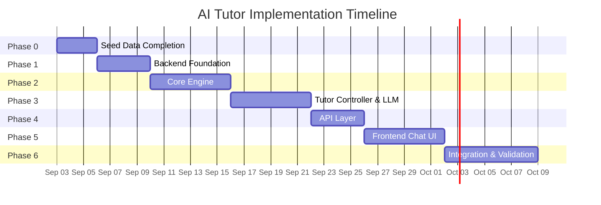

# AI Tutor — Implementation Plan

> **Status**: Awaiting approval before any code is written.

---

## Guiding Principles

Before diving into phases, these principles govern every implementation decision:

1. **Prove the tutoring loop first.** If the system can't teach one concept to one student, nothing else matters.
2. **One subject, one chapter.** Mathematics Chapter 2 (Quadratic Equations) is the pilot. No scope expansion until it works.
3. **Deterministic core, generative surface.** All routing, mastery tracking, question selection, and answer checking are deterministic Python. Only explanation generation, hint phrasing, and conversation use the LLM.
4. **Test with real data before real students.** Every component gets tested with the seed data before your sister ever sees it.
5. **No code without a passing test scenario.** Every function written must have at least one test that exercises it with the seed JSON data.

---

## Seed Data (Already Created)

The following seed data files have been created in the project and are ready for use:

| File | Contents | Records |
|:-----|:---------|:--------|
| [concepts.json](file:///mnt/DataDrive/What%20I%20want%20to%20Achieve/AI%20Tutor/data/curriculum/mathematics/concepts.json) | 14 concepts (7 prerequisites + 7 Chapter 2 concepts) with Urdu explanations, key terms, worked examples, and formulas | 14 |
| [prerequisites.json](file:///mnt/DataDrive/What%20I%20want%20to%20Achieve/AI%20Tutor/data/curriculum/mathematics/prerequisites.json) | Prerequisite DAG defining which concepts must be mastered before each concept | 14 edges |
| [ch02_quadratic_equations.json](file:///mnt/DataDrive/What%20I%20want%20to%20Achieve/AI%20Tutor/data/curriculum/mathematics/questions/ch02_quadratic_equations.json) | Question bank across all 6 difficulty levels with Urdu/English text, hints, and solution steps | 22 questions |
| [misconceptions.json](file:///mnt/DataDrive/What%20I%20want%20to%20Achieve/AI%20Tutor/data/curriculum/mathematics/misconceptions.json) | Misconception library with detection patterns, remediation strategies, and diagnostic mappings | 12 misconceptions |

> [!TIP]
> These seed files are starting points. They will grow as we build and test. After Phase 6, you'll add more questions and misconceptions based on real student interactions.

---

## Phase Overview



| Phase | Name | Duration | Dependencies | Core Deliverable |
|:------|:-----|:---------|:-------------|:-----------------|
| **0** | Seed Data Completion | 3 days | None | Complete seed JSON + initial assessment questions |
| **1** | Backend Foundation | 4 days | Phase 0 | FastAPI project, database schema, data import |
| **2** | Core Engine | 6 days | Phase 1 | Student model, curriculum model, math checker, question selector |
| **3** | Tutor Controller & Teaching Engine | 6 days | Phase 2 | Tutor state machine, LLM integration, guardrails |
| **4** | API Layer & Session Management | 4 days | Phase 3 | Chat endpoint, session persistence, streaming |
| **5** | Frontend Chat Interface | 6 days | Phase 4 | PWA with Urdu chat, math rendering, progress view |
| **6** | Integration Testing & Real Validation | 7 days | Phase 5 | End-to-end testing, your sister uses the system |
| | **Total** | **~5-6 weeks** | | |

---

## Phase 0: Seed Data Completion

**Goal**: Complete the content foundation so every downstream component has real data to work with.

### Entry Criteria
- Architecture document reviewed and approved ✓
- Seed files created ✓

### Deliverables

#### 0.1 Complete the Question Bank
The current seed has 22 questions. For a meaningful pilot, we need ~50 questions for Chapter 2.

**What to add:**
- 2-3 more questions per concept at each difficulty level
- At least 5 initial assessment questions (spanning prerequisite concepts)
- 3 board-style past paper questions for the chapter

**File**: `data/curriculum/mathematics/questions/ch02_quadratic_equations.json`

#### 0.2 Initial Assessment Questions
A separate set of diagnostic questions used to build the student's initial profile.

**File**: `data/curriculum/mathematics/questions/initial_assessment.json`

**Structure**: 10-15 questions spanning prerequisites and Chapter 2 concepts, ordered by difficulty:
- Q1-Q3: Basic arithmetic + algebra (prerequisite check)
- Q4-Q6: Algebraic identities + factorization (prerequisite check)
- Q7-Q9: Quadratic expression identification + standard form
- Q10-Q12: Solving quadratic equations (factorization + formula)
- Q13-Q15: Discriminant + nature of roots + word problems

#### 0.3 LLM Prompt Templates
Pre-written system prompts and few-shot examples for each teaching action.

**Files** (plain text, no code):
- `data/prompts/system_math_ur.txt` — Urdu math tutor system prompt
- `data/prompts/few_shot_teach_concept.txt` — Examples of good concept explanations
- `data/prompts/few_shot_diagnose.txt` — Examples of mistake diagnosis
- `data/prompts/few_shot_hint.txt` — Examples of progressive hints
- `data/prompts/few_shot_scaffold.txt` — Examples of scaffolded problem-solving

#### 0.4 Verify Data Integrity
Manually check:
- Every `concept_id` in questions.json exists in concepts.json
- Every `prerequisite_id` in prerequisites.json exists in concepts.json
- Every `diagnostic_question_id` in misconceptions.json exists in questions.json
- No circular dependencies in the prerequisite graph
- All Urdu text renders correctly

### Exit Criteria
- [ ] ≥ 50 questions in the question bank
- [ ] Initial assessment question set complete (10-15 questions)
- [ ] All prompt templates written
- [ ] Data integrity verified (no dangling references)
- [ ] All JSON files pass validation

### Testing
- **Manual review**: Read every question and verify the expected answer is correct
- **Automated**: Write a simple validation script that checks all cross-references between JSON files

---

## Phase 1: Backend Foundation

**Goal**: Project scaffolding, database setup, and data import pipeline.

### Entry Criteria
- Phase 0 complete (seed data verified)

### Deliverables

#### 1.1 Project Setup
- FastAPI project with proper directory structure (as defined in the architecture document)
- Python virtual environment with dependencies: `fastapi`, `uvicorn`, `pydantic`, `sympy`, `supabase-py`, `httpx` (for LLM calls)
- Environment configuration (`.env` file for API keys, database URL)
- Basic project configuration (`pyproject.toml` or `requirements.txt`)

#### 1.2 Database Schema
- PostgreSQL schema creation via Supabase (or local PostgreSQL for dev)
- All 9 tables from the architecture document:
  - `students`
  - `subjects`
  - `concepts`
  - `concept_prerequisites`
  - `questions`
  - `misconceptions`
  - `student_mastery`
  - `sessions`
  - `attempts`
- Row-level security policies (basic — student can only see their own data)

#### 1.3 Data Import Pipeline
- Script to import `concepts.json` → `concepts` table
- Script to import `prerequisites.json` → `concept_prerequisites` table
- Script to import `questions/*.json` → `questions` table
- Script to import `misconceptions.json` → `misconceptions` table
- Idempotent (safe to run multiple times)

#### 1.4 Pydantic Models (Schemas)
- Define all data models as Pydantic `BaseModel` classes
- These are the internal representations used throughout the codebase
- Match the architecture document structures exactly

### Exit Criteria
- [ ] FastAPI server starts and responds to health check (`GET /health`)
- [ ] Database tables created with correct schema
- [ ] All seed data imported successfully
- [ ] Pydantic models validate against seed data
- [ ] Import script is idempotent (can be re-run safely)

### Testing

| Test | Type | What it verifies |
|:-----|:-----|:-----------------|
| Health check endpoint | Unit | Server starts, responds 200 |
| Schema validation | Unit | Pydantic models match database schema |
| Data import | Integration | All seed JSON records imported, counts match |
| Idempotency | Integration | Running import twice doesn't create duplicates |
| Cross-reference check | Integration | All foreign keys resolve correctly |

---

## Phase 2: Core Engine

**Goal**: Build the three foundational engines that the Tutor Controller depends on — Student Model, Curriculum Model, and Answer Checking.

### Entry Criteria
- Phase 1 complete (database populated with seed data)

### Deliverables

#### 2.1 Curriculum Model
- `curriculum_model.py`:
  - Load concept graph from database
  - `get_concept(concept_id)` → full concept data
  - `resolve_concept(hint_text)` → fuzzy match concept from student's words
  - `get_prerequisites(concept_id)` → ordered list of prerequisites
  - `get_missing_prerequisites(concept_id, student)` → deepest unmastered prereqs
  - `get_concepts_by_chapter(chapter)` → all concepts in a chapter
  - DAG cycle detection (safety check on prerequisite graph)

#### 2.2 Student Model
- `student_model.py`:
  - `MasteryState` enum (UNKNOWN, ASSESSED_WEAK, INTRODUCED, PRACTICING, STRUGGLING, PARTIAL, MASTERED, NEEDS_REVIEW)
  - `ConceptMastery` class with update logic (transition rules from architecture doc)
  - `get_mastery(student_id, concept_id)` → current state
  - `update_mastery(student_id, concept_id, result)` → apply state transition
  - `record_misconception(student_id, concept_id, misconception_id)`
  - `get_weak_areas(student_id, subject)` → concepts with state STRUGGLING or ASSESSED_WEAK
  - `get_mastery_summary(student_id, subject)` → all concepts with their states

#### 2.3 Answer Checking Engine
- `math_checker.py`:
  - SymPy-based answer verification
  - `check_answer(student_input, expected, question_type)` → `AnswerResult`
  - Handle: exact match, symbolic equivalence, sign errors, partial answers (one root), parse errors
  - Input sanitization (student types `x^2` not `x**2`)
  - Common input normalization (e.g., `½` → `1/2`, `x2` → `x²`)
- `answer_result.py`:
  - `AnswerResult` dataclass: `is_correct`, `is_partial`, `error_type`, `misconception_id`, `feedback_hint`

#### 2.4 Question Selection
- `question_selector.py`:
  - `select_next_question(concept_id, student, question_bank)` → Question
  - Difficulty targeting based on mastery state
  - Avoids already-seen questions (falls back to previously-wrong ones)
  - Selects diagnostic questions when misconception is suspected

### Exit Criteria
- [ ] Curriculum model loads all 14 concepts and traverses prerequisite graph correctly
- [ ] Student model correctly transitions through all 8 mastery states
- [ ] Math checker correctly evaluates all 22 seed questions (expected answers)
- [ ] Math checker detects sign errors, single-root errors, and parse errors
- [ ] Question selector picks appropriate difficulty for each mastery state
- [ ] No cycle in prerequisite graph (validated by code)

### Testing

| Test | Type | What it verifies |
|:-----|:-----|:-----------------|
| Prerequisite graph traversal | Unit | `get_missing_prerequisites` returns correct deepest-first order |
| Cycle detection | Unit | Artificially add a cycle → system detects it |
| Mastery state transitions | Unit | All 10 transition rules from architecture doc work correctly |
| Consecutive correct → MASTERED | Unit | 3 consecutive correct answers transition to MASTERED |
| Consecutive wrong → STRUGGLING | Unit | 3 consecutive wrong answers transition to STRUGGLING |
| Time decay → NEEDS_REVIEW | Unit | MASTERED + 7 days = NEEDS_REVIEW |
| SymPy: correct answer | Unit | "x = 3" matches expected "3" |
| SymPy: symbolic equivalence | Unit | "x^2 + 2x + 1" matches "(x+1)^2" |
| SymPy: sign error detection | Unit | Student answers "3" when expected "-3" → sign_error |
| SymPy: single root detection | Unit | Student gives one root of two → incomplete_solution |
| SymPy: parse error handling | Unit | Garbage input → parse_error (no crash) |
| SymPy: input normalization | Unit | "x^2", "x²", "X^2" all parse correctly |
| Question selection: UNKNOWN student | Unit | Returns difficulty 2 question |
| Question selection: STRUGGLING student | Unit | Returns lower difficulty than last correct |
| Question selection: MASTERED student | Unit | Returns difficulty 5 (board style) |
| Question selection: no unseen questions | Unit | Falls back to previously-wrong questions |

> [!IMPORTANT]
> **Phase 2 is the most critical testing phase.** These are the foundational components. If the answer checker is wrong, the entire tutoring experience breaks. Every edge case matters.

---

## Phase 3: Tutor Controller & Teaching Engine

**Goal**: Build the brain (deterministic controller) and the voice (LLM-powered teaching engine).

### Entry Criteria
- Phase 2 complete (all core engine tests passing)

### Deliverables

#### 3.1 Language Layer
- `language_layer.py`:
  - `detect_intent(student_message)` → `StudentIntent` (structured LLM output)
  - Handles: Urdu script, Roman Urdu, English, mixed
  - Extracts: intent type, concept hint, student answer, raw math expression
  - Uses JSON mode / structured output from LLM
  - Fallback for when LLM can't determine intent

#### 3.2 Tutor Controller
- `tutor_controller.py`:
  - `tutor_decide(intent, student, session, curriculum)` → `TutorAction`
  - Pure deterministic logic (no LLM)
  - Handles all 12 TutorAction types from architecture
  - Intent routing: ask_concept, answer_question, solve_problem, greeting, off_topic, continue, repeat, change_subject, review
  - Prerequisite checking and redirection
  - Scaffolding enforcement (never gives full answer for "solve this")
  - Session state updates

#### 3.3 Teaching Engine
- `teaching_engine.py`:
  - `generate_response(action, context)` → Urdu tutor response
  - Takes a `TutorAction` + context and produces the appropriate LLM prompt
  - Injects: system prompt, concept data, student state, few-shot examples
  - Handles each action type differently:
    - `TEACH_CONCEPT`: Explains with worked example
    - `ASK_QUESTION`: Presents a question in Urdu
    - `GIVE_HINT`: Progressive hint (level 1 → 2 → 3)
    - `DIAGNOSE_MISTAKE`: Identifies and explains the specific error
    - `GIVE_FEEDBACK_CORRECT`: Encouraging confirmation + next step
    - `TEACH_PREREQUISITE`: Redirects to foundational concept

#### 3.4 LLM Client
- `llm_client.py`:
  - Unified interface for LLM API calls
  - Supports: Gemini Flash (primary), GPT-4o-mini (fallback)
  - Streaming support (SSE)
  - Retry logic with exponential backoff
  - Token counting and cost tracking
  - Timeout handling
  - Structured output mode (JSON) for intent detection

#### 3.5 Guardrail Layer
- `guardrails.py`:
  - `check_response(response, context)` → `GuardrailResult`
  - Answer leak detection (checks if expected answer appears in response)
  - Language drift detection (response should be in Urdu, not Hindi/English)
  - Length check (responses should be concise, 3-5 sentences)
  - Re-generation on failure (up to 3 retries)
  - Template fallback on persistent failure

### Exit Criteria
- [ ] Language layer correctly classifies 20+ test inputs (Urdu, Roman Urdu, English, mixed)
- [ ] Tutor controller makes correct decisions for all intent types
- [ ] Teaching engine produces Urdu responses for all 12 action types
- [ ] Guardrails catch answer leaks, language drift, and excessive length
- [ ] Complete tutoring loop works: student asks → intent detected → controller decides → teaching engine responds → guardrails pass
- [ ] LLM client handles API errors gracefully (timeout, rate limit, invalid response)

### Testing

| Test | Type | What it verifies |
|:-----|:-----|:-----------------|
| Intent: "ye quadratic equation kese solve hoga" | Integration | Detects intent=ask_concept, concept_hint="quadratic equation" |
| Intent: "x = 4" | Integration | Detects intent=answer_question, student_answer="4" |
| Intent: "assalam o alaikum" | Integration | Detects intent=greeting |
| Intent: "cricket ka match kab hai" | Integration | Detects intent=off_topic |
| Controller: ask_concept + missing prereq | Unit | Returns TEACH_PREREQUISITE (not TEACH_CONCEPT) |
| Controller: answer_question + correct | Unit | Returns GIVE_FEEDBACK_CORRECT, mastery updated |
| Controller: answer_question + 3 wrong | Unit | Returns TEACH_PREREQUISITE, misconception recorded |
| Controller: solve_problem | Unit | Returns TEACH_CONCEPT with scaffolding_mode=True (never solves directly) |
| Teaching: TEACH_CONCEPT | Integration | LLM produces Urdu explanation with formula |
| Teaching: GIVE_HINT level 1→2→3 | Integration | Each hint is progressively more revealing |
| Teaching: DIAGNOSE_MISTAKE | Integration | LLM identifies and explains the specific error |
| Guardrail: answer leaked | Unit | Response containing "x = 3" when that's the answer → blocked |
| Guardrail: Hindi text | Unit | Response in Hindi script → language_drift detected |
| Guardrail: too long | Unit | Response > 500 chars → flagged |
| LLM client: API timeout | Unit | Retries with backoff, returns error after 3 failures |
| LLM client: invalid JSON | Unit | Structured output parsing failure → handled gracefully |

> [!NOTE]
> **LLM-dependent tests require live API access.** These tests should be tagged separately and not block CI. Use recorded responses for fast unit tests, and live API calls for integration validation.

---

## Phase 4: API Layer & Session Management

**Goal**: Expose the tutoring loop as HTTP endpoints and persist session state.

### Entry Criteria
- Phase 3 complete (tutoring loop works end-to-end in code)

### Deliverables

#### 4.1 Session Manager
- `session_manager.py`:
  - `create_session(student_id, subject)` → session_id
  - `get_session(session_id)` → current session state
  - `update_session(session_id, updates)` → persist state changes
  - `end_session(session_id)` → generate session summary, save to DB
  - Auto-save after every exchange (crash recovery)
  - Resume session on reconnect

#### 4.2 API Endpoints

| Endpoint | Method | Purpose |
|:---------|:-------|:--------|
| `POST /api/auth/register` | POST | Student registration (name + phone) |
| `POST /api/auth/login` | POST | Student login |
| `POST /api/chat` | POST | Main tutoring endpoint — send message, get response |
| `GET /api/chat/stream` | GET (SSE) | Streaming version of chat endpoint |
| `POST /api/assessment/start` | POST | Start initial diagnostic assessment |
| `POST /api/assessment/answer` | POST | Submit assessment answer |
| `GET /api/progress/{student_id}` | GET | Student progress summary |
| `GET /api/progress/{student_id}/{subject}` | GET | Per-subject mastery breakdown |
| `GET /api/session/{session_id}` | GET | Current session state |
| `GET /health` | GET | Health check |

#### 4.3 Chat Flow (Main Endpoint)

```
POST /api/chat
{
  "session_id": "...",
  "message": "sir ye quadratic equation kese solve hoga"
}

→ Language Layer (detect intent)
→ Tutor Controller (decide action)
→ Teaching Engine (generate response)
→ Guardrails (verify)
→ Session Manager (save state)
→ Student Model (update mastery if applicable)

Response:
{
  "response": "... Urdu tutor response ...",
  "session_state": {
    "current_concept": "math10.ch2.quadratic_formula",
    "current_question": null,
    "hint_level": 0
  },
  "mastery_update": null
}
```

#### 4.4 Streaming Support
- Server-Sent Events (SSE) for real-time LLM response streaming
- Partial response delivery as tokens arrive
- Final response includes full metadata (session state, mastery updates)

#### 4.5 Error Handling
- Structured error responses (JSON with error code + Urdu message)
- Rate limiting (prevent abuse, 60 requests/minute per student)
- Input validation (message length, session ownership)
- Graceful degradation when LLM is unavailable

### Exit Criteria
- [ ] All API endpoints respond correctly with seed data
- [ ] Full tutoring conversation works via HTTP (not just in-memory)
- [ ] Session state persists across requests
- [ ] Session resumes after simulated disconnect
- [ ] Streaming endpoint delivers tokens as they arrive
- [ ] Error responses are structured and include Urdu messages
- [ ] Rate limiting works

### Testing

| Test | Type | What it verifies |
|:-----|:-----|:-----------------|
| Register + login flow | Integration | Student can register and authenticate |
| Chat: first message in new session | Integration | Session created, intent detected, response returned |
| Chat: 5-turn conversation | Integration | Session state maintained across turns |
| Chat: session resume | Integration | After gap, session loads correctly |
| Assessment: complete flow | Integration | 10 questions asked, student model initialized |
| Progress: after assessment | Integration | Mastery states reflect assessment results |
| Streaming: response arrives in chunks | Integration | SSE delivers partial tokens |
| Error: invalid session_id | Unit | Returns 404 with clear message |
| Error: empty message | Unit | Returns 400 with validation error |
| Rate limit: 61 requests in 1 minute | Integration | 429 returned on 61st request |

---

## Phase 5: Frontend — Chat Interface (PWA)

**Goal**: Mobile-first chat interface your sister can use on her phone.

### Entry Criteria
- Phase 4 complete (all API endpoints working and tested)

### Deliverables

#### 5.1 Core Pages

| Page | Route | Purpose |
|:-----|:------|:--------|
| Landing | `/` | Subject selection, "Continue where you left off" |
| Chat | `/chat` | Main tutoring interface |
| Assessment | `/assessment` | Initial diagnostic test |
| Progress | `/progress` | Mastery overview per subject |

#### 5.2 Chat Interface Components
- **Message bubble** — Supports Urdu text + LaTeX math (rendered via KaTeX)
- **Math input helper** — Common symbols (², √, ±, ÷) as quick-insert buttons
- **Typing indicator** — Shows when tutor is "thinking"
- **Session header** — Shows current subject, chapter, concept
- **Quick actions** — "آگے بتاؤ" (continue), "دوبارہ سمجھاؤ" (repeat), "مشکل ہے" (too hard)

#### 5.3 Math Rendering
- KaTeX integration for rendering LaTeX in chat messages
- Inline formulas in Urdu text: "discriminant کا formula ہے $D = b^2 - 4ac$"
- Block formulas for worked examples

#### 5.4 Progress View
- Visual mastery map showing concepts as nodes
- Color-coded: green (MASTERED), yellow (PRACTICING), red (STRUGGLING), gray (UNKNOWN)
- Tap concept → see details (attempts, mistakes, last studied)

### Exit Criteria
- [ ] Chat interface works on mobile browser (Chrome Android)
- [ ] Urdu text renders correctly (right-to-left)
- [ ] Math formulas render correctly (KaTeX)
- [ ] Full tutoring conversation possible through UI
- [ ] Progress view shows mastery states
- [ ] Quick action buttons work
- [ ] Dark mode looks good
- [ ] Interface works offline (cached shell, graceful "no connection" message)

### Testing

| Test | Type | What it verifies |
|:-----|:-----|:-----------------|
| RTL rendering | Manual | Urdu text flows right-to-left correctly |
| KaTeX rendering | Manual | Formula `x = \frac{-b \pm \sqrt{b^2-4ac}}{2a}` renders correctly |
| Mixed Urdu + math | Manual | "discriminant $D = b^2 - 4ac$ ہے" renders correctly |
| PWA install | Manual | Add to home screen on Android, opens like native app |
| Offline access | Manual | App opens when offline, shows cached UI |
| Chat flow | End-to-end | Send message → see typing indicator → receive response |
| Assessment flow | End-to-end | Complete 10-question assessment → see initial mastery |
| Progress view | End-to-end | After studying, progress reflects mastery changes |

---

## Phase 6: Integration Testing & Real Student Validation

**Goal**: End-to-end verification, then your sister uses the system for real study sessions.

### Entry Criteria
- Phase 5 complete (frontend connects to backend, full flow works)

### Deliverables

#### 6.1 End-to-End Test Scenarios

These are scripted, complete tutoring sessions that exercise the full system:

**Scenario 1: New student, first session**
1. Register → Login → Start assessment
2. Answer 10 assessment questions (mix of correct/wrong)
3. System builds initial student model
4. System recommends starting concept based on weaknesses
5. First tutoring exchange begins

**Scenario 2: Teach a concept from scratch**
1. Student asks: "مجھے discriminant سمجھاؤ"
2. System checks prerequisites → all met
3. System explains discriminant in Urdu
4. System asks Level 1 question
5. Student answers correctly → Level 2 question
6. Student answers correctly → Level 3 question
7. Student answers correctly → mastery = MASTERED

**Scenario 3: Missing prerequisite detected**
1. Student asks: "مجھے quadratic formula سمجھاؤ"
2. System checks prerequisites → discriminant is UNKNOWN
3. System says: "پہلے discriminant سمجھتے ہیں کیونکہ وہ formula میں استعمال ہوتا ہے"
4. System teaches discriminant first
5. After mastery, returns to quadratic formula

**Scenario 4: Misconception detected**
1. Student is solving: D = b² - 4ac for equation x² - 5x + 6 = 0
2. Student answers: D = -25 - 24 = -49 (sign error on b²)
3. System detects: misconception `math.ch2.discriminant_sign_b_squared`
4. System explains the (-5)² vs -5² difference
5. System gives practice question targeting this specific error

**Scenario 5: Scaffolded problem solving**
1. Student asks: "یہ سوال حل کر دو: 2x² - 7x + 3 = 0"
2. System does NOT solve it directly
3. Step 1: "پہلے a, b, c بتاؤ"
4. Student answers a=2, b=-7, c=3
5. Step 2: "اب discriminant نکالو"
6. Student calculates D = 49 - 24 = 25
7. Step 3: "فارمولے میں رکھو"
8. ...continues step by step

**Scenario 6: Session continuity**
1. Student studies for 20 minutes → session saved
2. Student closes app
3. Next day, student opens app
4. System says: "کل ہم discriminant پر کام کر رہے تھے۔ آج پہلے دیکھتے ہیں کہ تمہیں کتنا یاد ہے۔"
5. Quick review question → continue

**Scenario 7: Off-topic handling**
1. Student: "cricket ka match kab hai"
2. System: redirects gently back to studies
3. Student: "ok discriminant bataao"
4. System: continues tutoring

#### 6.2 LLM Response Quality Evaluation

For each teaching action, evaluate 10 sample responses on:

| Criterion | Score (1-5) | Threshold |
|:----------|:-----------|:----------|
| **Urdu quality** — Natural, not machine-translated | | ≥ 4 |
| **Accuracy** — Mathematically correct | | = 5 |
| **Conciseness** — 3-5 sentences, not verbose | | ≥ 4 |
| **Scaffolding** — Does NOT give full answer | | = 5 |
| **Encouragement** — Supportive tone | | ≥ 3 |
| **Technical terms** — English terms used correctly | | ≥ 4 |

> [!WARNING]
> **If accuracy scores below 5 on any response, that is a system failure.** The tutor must NEVER teach wrong math. Fix the prompt or add a guardrail check before proceeding.

#### 6.3 Real Student Validation Protocol

This is the final and most important validation.

**Week 1 (Supervised)**:
- Your sister uses the system with you present
- You observe every interaction
- You log: what worked, what confused her, what she ignored
- You note: Did she understand the Urdu? Was the math clear? Did she engage?
- After each session, ask her: "کیا سمجھ آیا؟" (Did you understand?)

**Logging checklist per session:**
- [ ] Did the initial assessment correctly identify her level?
- [ ] Did the prerequisite check redirect appropriately?
- [ ] Did the explanations make sense to her?
- [ ] Did she answer questions without external help?
- [ ] Were the hints helpful or too vague?
- [ ] Did misconception detection trigger when it should?
- [ ] Was the Urdu natural and understandable?
- [ ] How long did the session last? (target: 20-30 minutes)

**Week 2 (Semi-supervised)**:
- She uses the system independently
- You check logs after each session
- Focus on: drop-off points (where she stopped), repeated errors, questions she skipped

**The Ultimate Test (Day 14)**:
1. She has studied "Discriminant" and "Nature of Roots" using the system
2. Give her a **new problem** (not from the question bank):
   - "2x² + 3x - 5 = 0 کی جڑوں کی نوعیت بتاؤ"
3. She solves it on paper, without the app
4. **If she solves it correctly**: The tutor works
5. **If she can't**: Identify the gap, fix the system, repeat

#### 6.4 Bug Fix & Iteration
- Based on validation findings, fix the highest-priority issues
- Re-run affected test scenarios
- If significant changes needed, update implementation plan

### Exit Criteria
- [ ] All 7 end-to-end scenarios pass
- [ ] LLM response quality ≥ thresholds on all criteria
- [ ] Your sister has completed ≥ 5 tutoring sessions
- [ ] Your sister passes the "new problem" test for at least 1 concept
- [ ] No critical bugs remaining
- [ ] Session logs show genuine learning (not just clicking through)

---

## Testing Strategy Summary

### Test Pyramid

```
                    ┌───────────────────┐
                    │   Real Student    │  ← Phase 6 (1 student)
                    │   Validation      │
                    ├───────────────────┤
                    │  End-to-End Tests │  ← Phase 6 (7 scenarios)
                    │  (Full System)    │
                    ├───────────────────┤
                    │ Integration Tests │  ← Phase 3-5
                    │ (API, LLM, DB)    │
                    ├───────────────────┤
                    │   Unit Tests      │  ← Phase 2-3 (50+ tests)
                    │ (Pure functions)  │
                    └───────────────────┘
```

### Test Categories

| Category | What | When | Tools |
|:---------|:-----|:-----|:------|
| **Unit** | Pure functions (mastery transitions, answer checking, question selection) | Phase 2-3 | pytest |
| **Integration** | API endpoints, database operations, LLM calls | Phase 3-5 | pytest + httpx |
| **E2E** | Complete tutoring scenarios | Phase 6 | Scripted test runner |
| **LLM Quality** | Response quality evaluation | Phase 3, 6 | Manual + rubric |
| **Real Student** | Actual learning validation | Phase 6 | Observation + paper test |

### What We Do NOT Test
- UI pixel-perfection (manual review is sufficient for V1)
- Load testing (one student at a time for V1)
- Cross-browser compatibility (Chrome Android only for V1)

---

## Risk Watchlist

These are the things most likely to go wrong. Check each at the end of every phase.

| Risk | Phase | Trigger | Response |
|:-----|:------|:--------|:---------|
| SymPy can't parse student's input format | Phase 2 | Student writes "x2" or "x ka square" | Add more input normalizations; fallback to LLM checking |
| LLM gives wrong math explanation | Phase 3 | Any math error in LLM response | Add formula validation guardrail; never let LLM compute |
| LLM defaults to Hindi instead of Urdu | Phase 3 | Response in Devanagari script | Add language detection guardrail; strengthen system prompt |
| Gemini API rate limits hit | Phase 4 | 429 errors during testing | Add request queuing; switch to GPT-4o-mini fallback |
| Session state lost on app crash | Phase 4 | Student loses progress | Save state after every exchange; add recovery endpoint |
| KaTeX doesn't render some formulas | Phase 5 | Broken math display | Test all formulas from seed data in KaTeX; fix templates |
| Student finds the Urdu unnatural | Phase 6 | Sister says "ye to samajh nahi aaraha" | Collect her exact phrasing; update prompts and few-shot examples |
| Student bypasses tutoring, demands answers | Phase 6 | Student types "seedha answer batao" | System prompt handles this; scaffolding is enforced |

---

## What Happens After Phase 6

Once Phase 6 passes — the system teaches one concept to one real student — then (and only then) do we expand:

| Next Step | What | Depends On |
|:----------|:-----|:-----------|
| Add remaining Math chapters | Create seed data for Chapters 1, 3-8 | Phase 6 passing |
| Add Physics | Create seed data + physics checker with unit validation | Math working well |
| Spaced review system | SM-2 algorithm for review scheduling | 2+ weeks of student data |
| Image upload | Student photographs homework questions (Vision API) | Core tutoring proven |
| Progress dashboard | Visual mastery map | More concepts in the system |
| Multi-student support | Separate student profiles | Phase 6 proven |

> [!CAUTION]
> **Do NOT start any of these until Phase 6 is complete and the real student validation passes.** Expanding prematurely is the #1 killer of educational technology projects.

---

## Open Questions for You

Before we start Phase 0 completion and move to Phase 1, please confirm:

1. **Board**: Is your sister in Punjab Board? (The seed data assumes Punjab PCTB 2026-27 textbook)
2. **Textbook**: Do you have access to the actual Class 10 Mathematics textbook (PDF or physical)? We'll need to verify concept order and page references.
3. **LLM API**: Which LLM API do you have access to? (Gemini API key / OpenAI API key / both?)
4. **Database**: Supabase (cloud, free tier) or local PostgreSQL? Supabase is faster to start, but local gives you more control.
5. **Device**: What phone does your sister use? (Android version matters for PWA)
6. **Timeline**: The plan estimates ~5-6 weeks. Is that realistic for your availability, or should we compress/expand?
